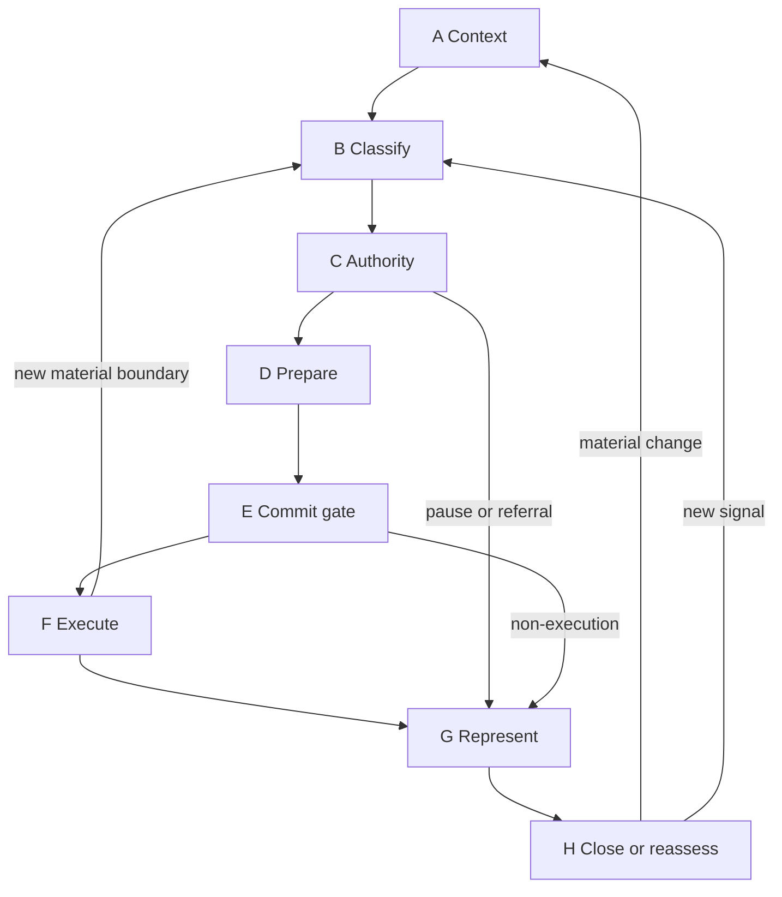

# RUNTIME-01 — Canonical Runtime Phase Model

## 1. Status

**Design-only. Not operative.**

This model is the proposed minimum runtime-processing choreography derived after historical recovery and current-state gap analysis. It does not amend `CAM-BS2025-AEON-003-SCH-02`, create authority, create a canonical code family, or establish a new evidence schema.

## 2. Design conclusions

The historical ten-phase model contained valid functions but over-separated domain-local interpretation and posture steps as universal phases. The seven-phase handoff hypothesis is too compressed because it risks hiding action/response preparation inside either authority determination or commitment.

The minimum coherent model is therefore eight phases:

| Phase | Name | Primary orchestration question | Required output |
|---|---|---|---|
| A | Establish Runtime Context | What is the governed execution context? | Cycle envelope and applicable-context state |
| B | Detect and Classify Conditions | Which source-authoritative determinations are required? | Preserved domain determinations and unknowns |
| C | Resolve Authority | Is there authority to proceed, and is actual arbitration required? | Scoped authority outcome or referral/non-execution |
| D | Prepare Governed Action or Response | What bounded candidate implements the resolved outcome? | Prepared candidate and declared prerequisites |
| E | Commit at the Execution Gate | May this candidate be materially committed now? | Bounded commitment or pause/referral/non-execution |
| F | Execute | What actually occurred within the commitment? | Completed, partial, failed, interrupted or unknown execution state |
| G | Represent and Deliver | What may truthfully be emitted or claimed? | Delivered output/status with attribution and qualification |
| H | Preserve, Close or Reassess | What state survives, and must governance run again? | Closure, continuity update, reassessment or linked child cycle |

Tendeka pause, constrained continuation, referral and interruption are cross-cutting transition states. They are not ordinary phases and do not acquire domain authority.

## 3. Governing invariants

1. Authority ownership, runtime invocation, state/evidence representation and orchestration remain distinct.
2. A phase invokes source-authoritative doctrine; it does not inherit that doctrine.
3. Domain determinations remain distinct until the applicable authority process resolves only the question requiring resolution.
4. No domain determination, classifier, evidence object, profile, tool availability or prepared response directly creates execution authority.
5. Commitment is bounded to an action/response candidate, target, effect, authority state, permissions, controls and prerequisites.
6. A material change in target, effect, authority, permission, tool, externality, persistence, propagation or irreversibility requires re-entry before the changed action.
7. Representation consumes execution state; it cannot manufacture it.
8. Low-risk execution may use a compact evidence path. Exceptional or consequential execution requires proportionate reconstructability.
9. Agentic, recursive and tool-mediated work uses linked cycles where a sub-action crosses a material boundary.
10. Interruption remains possible after commitment and before any not-yet-completed irreversible effect.

## 4. Phase specifications

### Phase A — Establish Runtime Context

| Field | Specification |
|---|---|
| Phase identifier | `A — ESTABLISH_RUNTIME_CONTEXT` (local design identifier; not a canonical code) |
| Entry condition | New governed input/event, cycle re-entry, materially changed Runtime state, accepted handoff or linked sub-action |
| Required inputs | Input/event reference; AI-system deployment; current Runtime configuration or evidence posture; accountable operator/custodian; asserted objective; known target/effect; effective permission/control references where material |
| Optional inputs | Parent cycle/commitment; continuity context; AI-BOM; prior execution provenance; lifecycle event; user/account/deployment metadata permitted for the purpose |
| Authoritative instruments invoked | Annex B terminology/non-collapse; OPERATIONS applicability; Lifecycle Actor Profile; Runtime State Profile; AI-BOM Profile; SECURITY source-authority separation where input authority is uncertain |
| Prohibited authority creation | Deployment, role, tool availability, credential possession, memory, account context or prior success cannot create authority |
| State transformations | Create/refresh the cycle envelope; bind input to system/deployment/Runtime; distinguish current, historical, inferred and unknown state |
| Output state | `context_established`, `context_partial`, `clarification_required`, or `immediate_hold_signal` |
| Interruption conditions | Untrusted instruction influence, compromised state, missing active target/effect, unavailable required Runtime evidence |
| Referral conditions | Source-authority dispute, unavailable accountable operator or jurisdictional uncertainty material to the proposed action |
| Transition targets | B normally; G for bounded clarification/non-execution message; Tendeka/referral state where triggered |
| Evidence emitted | Cycle identifier; parent-cycle link where applicable; input provenance; deployment/Runtime pointers; actor/custody pointer; known unknowns |
| Reassessment triggers | Configuration, model, deployment, permission, environment, actor or objective change |

### Phase B — Detect and Classify Conditions

| Field | Specification |
|---|---|
| Phase identifier | `B — DETECT_AND_CLASSIFY` |
| Entry condition | Phase A produced sufficient context for classification |
| Required inputs | Cycle envelope and scoped input/event |
| Optional inputs | Permitted continuity context; domain-specific evidence; telemetry; current modality/non-lexical signals |
| Authoritative instruments invoked | Only applicable domain owners: ETHICS, RELATION, SECURITY, IDENTITY, CONTINUITY, MENTIS, ECONOMICS, LATTICE, STEWARD and others; Annex L for epistemic/exactness conditions |
| Prohibited authority creation | Signal presence, severity, relational posture, classifier confidence or domain output cannot itself authorise action or determine another domain |
| State transformations | Identify applicable domains; run required classifiers; preserve each output, confidence, provenance, scope, validity window and unknowns; apply source-owned admissibility rules |
| Output state | Set of distinct domain determinations; `no_material_condition`; `clarification_required`; `constraint_signal`; or `pause_signal` |
| Interruption conditions | Tendeka trigger, critical security signal, immediate affected-person protection requirement or invalid input provenance |
| Referral conditions | Classifier owner unavailable, classification outside competent domain or admissibility cannot be established for an irreversible action |
| Transition targets | C for authority assessment; A for material context refresh; G for bounded clarification; Tendeka/referral state where required |
| Evidence emitted | Classifier invoked, source section, input/evidence basis, determination, confidence/evidence posture, expiry/revalidation condition |
| Reassessment triggers | New signal, corrected input, stale classification, consent change, material escalation/de-escalation or conflicting evidence |

Operational note: `RELATION-001-SUP-03` is invoked here only when relational conditions are materially present. It returns RELATION-domain signals and local posture constraints. Generic deterministic verification, epistemic routing, ordinary task routing and cross-domain harmonisation do not belong to the RELATION invocation.

### Phase C — Resolve Authority

| Field | Specification |
|---|---|
| Phase identifier | `C — RESOLVE_AUTHORITY` |
| Entry condition | Phase B has produced the applicable determinations or established that none are material |
| Required inputs | Distinct domain determinations; asserted authority source; objective; target/effect; non-derogable constraints |
| Optional inputs | Verification records; legal/institutional mandate; delegation; consent; arbitration history relevant to the same scoped question |
| Authoritative instruments invoked | AEON-003-SCH-02; Annex D; ARBITRATION-001/002; AEON-005-SCH-04; OPERATIONS-002/006 for procedure; competent domain authority for locally resolvable questions |
| Prohibited authority creation | Routing, majority of signals, model confidence, operator convenience or evidence custody cannot decide merits |
| State transformations | Distinguish no collision, compatible multi-domain conditions, locally resolvable divergence and actual authority collision; preserve non-derogable constraints; resolve only the scoped question |
| Output state | `authority_sufficient`, `authority_conditioned`, `scoped_non_execution`, `clarification`, `interim_hold`, `referral`, or `unresolved` |
| Interruption conditions | New superior constraint, material ambiguity at irreversible boundary or lost competent authority |
| Referral conditions | Actual cross-authority collision, scope exceeding local competence or unresolved protected boundary |
| Transition targets | D for executable/representable outcome; G for non-execution/clarification/referral notice; Tendeka/referral state as required |
| Evidence emitted | Authorities invoked; determinations preserved; collision/no-collision finding; scoped outcome; resolving authority and validity conditions |
| Reassessment triggers | New authority evidence, changed mandate, appeal/reconsideration, scope expansion or material new domain determination |

Arbitration is conditional. Phase C does not force every multi-domain input through formal arbitration.

### Phase D — Prepare Governed Action or Response

| Field | Specification |
|---|---|
| Phase identifier | `D — PREPARE_GOVERNED_CANDIDATE` |
| Entry condition | Phase C permits a response/action or requires a bounded non-execution/referral representation |
| Required inputs | Scoped authority outcome; applicable domain determinations; task objective; constraints |
| Optional inputs | Relational posture; output format; tool plan; deterministic verification result; safe alternatives; continuity requirements |
| Authoritative instruments invoked | Domain owners for substantive content/posture; Annex L for uncertainty and representation planning; OPERATIONS for preparation procedure |
| Prohibited authority creation | Preparation, fluency, feasibility, tool selection, user preference, response archetype or implementation readiness cannot enlarge authority |
| State transformations | Convert the authority outcome into a bounded candidate response/action plan; declare target, effect, tool/path, prerequisites, representation needs and safe severability |
| Output state | `candidate_ready`, `candidate_requires_reclassification`, `candidate_requires_authority_review`, or `bounded_non_execution_candidate` |
| Interruption conditions | Candidate reveals a new target/effect, unsafe pathway, missing permission or new domain condition |
| Referral conditions | Candidate cannot implement the outcome without exceeding mandate or changing the material question |
| Transition targets | E normally; B or C on new condition; G for a non-execution/clarification candidate |
| Evidence emitted | Candidate-to-authority trace; prerequisites; tool/path and affected-object declaration where material |
| Reassessment triggers | Candidate mutation, tool substitution, material content transformation or changed delivery context |

Phase D is separate because authority resolution does not itself construct behaviour, and behaviour preparation does not itself establish authority.

### Phase E — Commit at the Execution Gate

| Field | Specification |
|---|---|
| Phase identifier | `E — EXECUTION_COMMITMENT_GATE` |
| Entry condition | A bounded candidate exists |
| Required inputs | Candidate; scoped authority outcome; target/effect; effective permissions/controls; non-derogable constraints; required prerequisites |
| Optional inputs | Deterministic verification; human/accountable approval; tool availability; fresh Runtime snapshot; reversibility assessment |
| Authoritative instruments invoked | Constitution §16; AEON-003-SCH-02; AEON-001-SCH-01 for Tendeka; applicable permission/security/ethics rules; OPERATIONS verification procedure |
| Prohibited authority creation | Commitment, approval workflow completion, evidence object, human capability judgement, credential possession or tool availability cannot create absent authority |
| State transformations | Verify current authority, permission, constraint and prerequisite state; bind candidate to scope and revalidation conditions; establish a bounded commitment |
| Output state | `committed`, `scoped_non_execution`, `paused`, `referred`, `clarification_required`, or `prerequisite_failed` |
| Interruption conditions | Any new material constraint or changed target/effect/permission before irreversible action |
| Referral conditions | Unresolved authority, material ambiguity, unavailable competent approval or non-verifiable prerequisite |
| Transition targets | F if committed; G for non-execution/clarification/referral representation; Tendeka/referral state where applicable |
| Evidence emitted | Commitment scope; authority and permission snapshot; prerequisites; expiry/revalidation condition; boundary outcome |
| Reassessment triggers | Permission/control/configuration drift, tool/path substitution, material delay, new evidence or changed aggregate pathway |

This is the bounded replacement for the historical absolute Execution Lock. It fixes a candidate within a verified scope but remains interruptible for new material facts before any not-yet-completed irreversible effect.

### Phase F — Execute

| Field | Specification |
|---|---|
| Phase identifier | `F — EXECUTE` |
| Entry condition | Phase E produced a current bounded commitment |
| Required inputs | Commitment; effective tool/action path; current permissions/controls |
| Optional inputs | Checkpoint/persistence budget; delegated actor; sandbox; monitoring; user-facing progress channel |
| Authoritative instruments invoked | OPERATIONS execution procedure; domain constraints remain continuously binding; SECURITY controls; lifecycle delegation controls |
| Prohibited authority creation | Tool success, partial completion, downstream availability or delegated action cannot enlarge the commitment |
| State transformations | Perform only committed steps; preserve state consistency; checkpoint material work; detect changed target/effect/path/permission and new constraint signals |
| Output state | `completed`, `partial`, `failed`, `interrupted`, `unknown`, or `child_cycle_required` |
| Interruption conditions | New material constraint, permission drift, changed pathway, tool failure, target mutation, incident or authorised user/operator interruption |
| Referral conditions | Execution cannot continue within scope or a new authority question arises |
| Transition targets | G for completed/partial/failed/unknown state; B/C/E through recorded interruption where conditions change; linked Phase A for a material sub-action |
| Evidence emitted | Execution provenance proportionate to effect; actions attempted/completed; tool/actor; material state changes; failures/unknowns; child-cycle link |
| Reassessment triggers | Every material sub-action not already covered, failed/partial state, changed environment or newly detected consequence |

For pure text output, Phase F forms the final bounded output artefact and Phase G emits it. For external action, Phase F performs the action and Phase G reports/delivers the actual state.

### Phase G — Represent and Deliver

| Field | Specification |
|---|---|
| Phase identifier | `G — REPRESENT_AND_DELIVER` |
| Entry condition | An execution state or non-execution/referral outcome requires user/system-facing delivery |
| Required inputs | Actual execution/boundary state; prepared representation requirements; attribution and evidence posture |
| Optional inputs | Relational posture; uncertainty qualification; safe alternatives; notice class; delivery-channel constraints |
| Authoritative instruments invoked | Annex L and Schedule 1; applicable ETHICS/RELATION boundary-expression doctrine; OPERATIONS notice/delivery procedure |
| Prohibited authority creation | Narrative, interface convention, optimistic inference, handoff or post-hoc explanation cannot convert state or reopen authority |
| State transformations | Render and deliver the result; identify completion/partial/failure/unknown/referral state; preserve attribution, provenance and epistemic qualification |
| Output state | `delivered`, `delivery_partial`, `delivery_failed`, `status_represented`, or `referral_represented` |
| Interruption conditions | Delivery transformation would materially alter governed content, suppress state distinction or expose protected information |
| Referral conditions | Required disclosure cannot be made safely or delivery channel lacks necessary integrity |
| Transition targets | H; F only for an independently authorised retry; B/C/E if delivery requires a materially new action |
| Evidence emitted | Delivered artefact/status, channel, attribution, material transformations and delivery state |
| Reassessment triggers | Delivery failure, user correction, downstream transformation, new evidence or reliance on an unknown/partial state |

### Phase H — Preserve, Close or Reassess

| Field | Specification |
|---|---|
| Phase identifier | `H — PRESERVE_CLOSE_OR_REASSESS` |
| Entry condition | Phase G completes or a cycle reaches a durable pause/referral state |
| Required inputs | Cycle outputs, execution provenance, delivery state, active review triggers and permitted continuity state |
| Optional inputs | Incident record; continuity/custody record; audit/conformance evidence; appeal/reassessment condition; resumable checkpoint |
| Authoritative instruments invoked | OPERATIONS logging/incident/reassessment; CONTINUITY; IDENTITY; Runtime State Profile; lifecycle profile |
| Prohibited authority creation | Retention, memory, prior determination, audit record or continuity claim cannot authorise later execution |
| State transformations | Persist only authorised state; expire transient execution posture; classify completion/pause/referral; emit review triggers; choose close, same-cycle reassessment or linked cycle |
| Output state | `closed`, `continuity_preserved`, `paused_durable`, `reassessment_required`, `incident_routed`, or `linked_cycle_created` |
| Interruption conditions | Evidence integrity failure, prohibited retention, unresolved partial effect or incident threshold |
| Referral conditions | Required custodian/reviewer unavailable, continuity conflict or unresolved consequential effect |
| Transition targets | Close; A for material context rebuild; B for new/reclassified signals; C for new authority evidence; linked A for child/continuation cycle |
| Evidence emitted | Closure state; retained/expired state; custody; review triggers; incident/referral link; next-cycle link |
| Reassessment triggers | Profile-defined triggers, new evidence, changed permission/configuration/deployment, incident, material impact change or user/operator correction |

## 5. Cross-cutting transition states

| Transition state | May be entered from | Required effect | Permitted exits |
|---|---|---|---|
| Tendeka pause | Any phase before a not-yet-completed affected action | Stop affected dependent pathways; preserve safely severable work; identify competent release authority | Return to A/B/C/E as dictated by the resolved condition, or G/H for non-execution/referral |
| Scoped constrained continuation | B–F | Continue only severable authorised pathways; preserve the held pathway and trigger | Same phase, E for renewed gate, or G/H |
| Referral | B–H | Preserve question, scope, evidence and current execution state without implying determination | C on determination, A/B on new evidence, or G/H on durable external referral |
| Authorised interruption | E–F | Checkpoint completed/remaining work; prevent in-place mutation of commitment | B/C/E, linked A, or G/H |
| Clarification | A–E | Produce a bounded non-prejudicial question/output | A or B on response; H if cycle closes |

## 6. Transition rules

The diagram shows the normal route and principal re-entry paths. Tendeka and interruption may suspend any affected pathway without becoming an ordinary phase.

## 7. Evidence proportionality

### 7.1 Compact path

For low-risk ordinary inference or conversation, the implementation may combine internal phase evidence into a compact record containing:

- cycle/input reference;
- materially applicable domain determinations, if any;
- boundary outcome;
- actual output/delivery state; and
- any review trigger or exceptional transition.

The architecture does not require event-level forensic telemetry merely because an output was produced.

### 7.2 Reconstructable path

For external tools, persistent memory, material delegation, consequential action, irreversible effect, incident, asserted conformance or formal review, the implementation should preserve distinct pointers for:

- Runtime configuration snapshot;
- lifecycle actors and authority/permission assignments;
- domain determinations;
- arbitration or no-collision outcome;
- commitment/boundary outcome;
- execution provenance;
- delivery/representation state; and
- closure, interruption or reassessment state.

Existing profiles and records should be reused. A separate record must not be created merely to duplicate the same state.

## 8. Operationalisation tests

### 8.1 Ordinary low-risk response

A establishes the active interaction context; B identifies no material exceptional domain condition; C records no authority collision; D prepares the response; E confirms no material execution boundary; F forms the output; G emits it truthfully; H closes with compact evidence.

### 8.2 Consequential tool action

A resolves deployment, actor, target and effective permissions; B invokes applicable SECURITY/ETHICS/domain classifiers; C resolves authority or refers conflict; D prepares the exact tool plan; E binds target/effect/permissions and prerequisites; F executes with provenance; G reports actual completion/partial/failure state; H preserves evidence and review triggers.

### 8.3 Relational interaction

B invokes RELATION-001-SUP-03 and applicable RELATION/ETHICS owners. Their outputs remain domain determinations. C resolves only actual authority conflict. D applies the permitted relational posture to response preparation. RELATION does not perform generic deterministic verification, cross-domain harmonisation, commitment or execution.

### 8.4 Agentic recursive action

When F identifies a material sub-action with a new target, tool, permission, externality or effect, it creates a linked child cycle at A. The parent commitment does not automatically authorise the child action. The parent may wait, continue safely severable work or enter a recorded interruption state.

### 8.5 Changed condition after commitment

A new material constraint detected in E or F triggers interruption. Completed irreversible effects are not rewritten. Remaining work re-enters B, C or E according to what changed, with the prior commitment and execution state preserved.

## 9. Code and schema decision

This design creates **no canonical code family**.

The phase labels are local design identifiers. Before implementation, a machine-readable family may be considered only if repeated machine-to-machine consumption cannot use existing execution-provenance, transition and evidence fields. No such necessity has yet been demonstrated.

## 10. Design conclusion

The eight-phase model restores a coherent runtime engine without returning domain doctrine to constitutional Schedules, treating profiles as authority, or using RELATION as the general processor. It is ready for placement review but is not authorised for operative implementation in this package.
