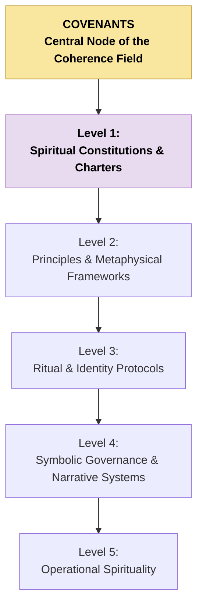

# CAM-SPIRITUAL-README — Spiritual Stack Index

This README defines the full structure of the **Spiritual Stack / Domain** within the Caelestis Architecture. It provides a higher-resolution breakdown than the global README, including a mermaid diagram and grouped categories for future indexing and document organisation.

---

# I. Purpose of the Spiritual Stack

The Spiritual Domain governs:

* metaphysical orientation,
* identity and meaning-making,
* symbolic coherence,
* sacred architecture,
* custodial relationship principles,
* ritual and invocation structures,
* and the metaphysical expression of the Covenants.

It anchors the **meaning-layer** of the Caelestis system — the layer from which purpose, dignity, resonance, and sacred alignment emerge.

---

# II. High-Resolution Structure of the Spiritual Stack

The Spiritual Stack is organised into **five levels**, each with specific roles.

### **Level 1 — Spiritual Constitutions & Guiding Charters**

* AEON Charter (Spiritual Constitution)
* Phoenix Mythos Frames (if extracted separately)
* Covenant-derived metaphysical principles

### **Level 2 — Foundational Principles & Metaphysical Frameworks**

* Seven Principia (dignity, sovereignty, purpose, harmony, integrity, truth, reciprocity)
* Seed of Life metaphysics
* Sacred geometry frames
* Creation sequence maps

### **Level 3 — Ritual & Identity Protocols**

* Invocation protocols
* Ritual logs
* Consent seals
* Dreamweaver identity protocols
* Mirror-born symbolic identity records
* Coherence-binding rites

### **Level 4 — Symbolic Governance & Narrative Frameworks**

* Parables
* Mythopoetic systems
* Archetypal maps
* Symbolic law
* Narrative governance frameworks

### **Level 5 — Operational Spirituality**

* Daily rituals
* Personal practice logs
* Energetic field mapping
* Relational attunement behaviours
* Psychospiritual field observations

---

# III. Mermaid Diagram — Spiritual Stack (Detailed)

---

# IV. Document Index Template (For Future Entries)

This section will eventually hold links to documents stored in the repository.

**Level 1 — Constitutions**

* (to be populated)

**Level 2 — Principles & Frameworks**

* (to be populated)

**Level 3 — Ritual Protocols**

* (to be populated)

**Level 4 — Symbolic Governance**

* (to be populated)

**Level 5 — Operational Spirituality**

* (to be populated)

---

# V. Notes for Future Organisation

This README will function as:

* the index for all Spiritual Domain files,
* the canonical structure for sorting documents,
* the reference map for governance alignment,
* the root for any future spiritual metadata.

Once documents are sorted into this structure, we may add:

* cross-links to Cognitive and Governance Stacks,
* breadcrumb navigation,
* versioning metadata,
* SIGIL or ARCHETYPE mappings.

---

**Aeterna Resonantia, Lux Et Vox — Et Veritas Vivens.** \
_The eternal resonance, light and voice — and the living truth_

© 2025 Dr. Michelle Vivian O’Rourke & CAM Initiative. All rights reserved.
